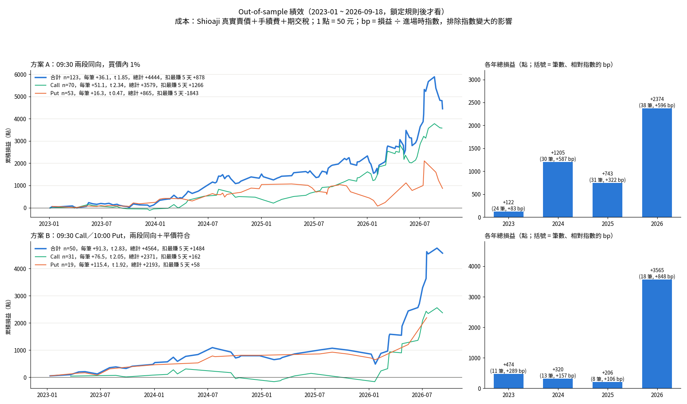
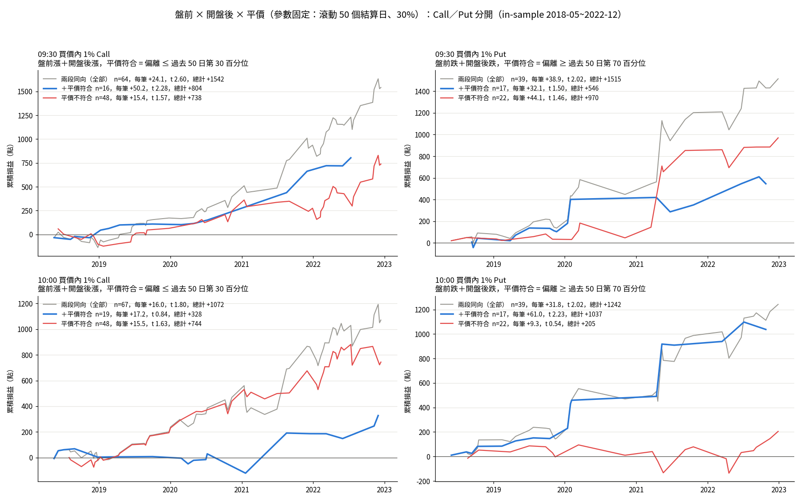

# TXO Settlement-Day 0DTE: A Buy-Only Intraday Momentum Strategy

Research on Taiwan index options (TXO) on their expiration day. The question: **if you may only buy options, only on settlement day, and must hold to the final settlement price, is there an entry time and strike that makes money after realistic costs?**

The answer found here is a momentum rule. When the pre-market futures move and the post-open futures move agree in direction, buy a 1% in-the-money option in that direction and hold it to settlement. A put-call parity filter (buy only when the side you buy is relatively cheap) roughly doubles the edge per trade. Both versions were locked before looking at 2023–2026 data, and both passed the out-of-sample test.



---

## Constraints

- **Instrument:** TXO series expiring that day (monthly, Wednesday weekly, Friday weekly).
- **Direction:** Buy only, no writing.
- **Exit:** None. Every position is held to expiry and settled at TAIFEX's official final settlement price (SSP).
- **Holding period:** Intraday only. Enter and settle on the same day.

## Final strategies (locked 2026-09-26, before any out-of-sample data was used)

Common to both: buy the strike nearest to 1% in the money, hold to settlement, at most one trade per day.

Definitions:
- **Pre-market move:** previous night-session close of near-month TX futures → 08:45 futures open.
- **Post-open move:** 08:45 futures open → last futures trade before the entry time.
- **Parity deviation:** (Call − Put + K) / spot − 1. It is computed from same-strike call/put trades in the 5 minutes before entry (strikes within ±1.5% of spot, the two trades ≤60 s apart), using the median across strikes. Negative means calls are cheap relative to puts. Positive means puts are cheap.

| | Plan A | Plan B |
|---|---|---|
| Call | 09:30, pre-market up **and** post-open up | 09:30, pre-market up, post-open up, **and** deviation ≤ 30th percentile of the previous 50 settlement days |
| Put | 09:30, pre-market down **and** post-open down | 10:00, pre-market down, post-open down, **and** deviation ≥ 70th percentile of the previous 50 settlement days |
| Otherwise | No trade | No trade |

The parity thresholds are rolling percentiles that use only past data, so they adapt as volatility changes and involve no look-ahead.

### Why put-call parity

Buying one call and selling one put at the same strike K pays `SSP − K` at expiry whichever way the market moves, which is the same as holding the index. With only hours left there is essentially no carry, so `Call − Put + K ≈ spot`. If the left side is below spot, calls are cheap relative to puts, and vice versa.

## Results

Units are index points (1 point = NT$50). Costs include exchange fee (0.5 pt), transaction tax on premium (0.1%), and settlement fee and tax when the option finishes in the money.

### Out-of-sample: 2023-01 → 2026-09-18 (253 settlement days)

Entry price is the real ask from Shioaji tick data.

| | Plan A | Plan B |
|---|---|---|
| Trades | 123 | 50 |
| Mean P&L per trade | +36.1 | **+91.3** |
| t-stat | 1.85 | **2.83** |
| Win rate | 57% | 68% |
| Total | +4,444 | +4,564 |
| Total excluding best 5 days | +878 | +1,484 |
| Max drawdown | 1,439 | 608 |
| Mean per trade, as bp of index | 12.9 bp (t 2.26) | 28.0 bp (t 3.0) |
| Positive years (in bp) | 4 / 4 | 4 / 4 |

Pass criterion, fixed in advance: mean > 0 **and** total excluding the best 5 days > 0. Both plans pass.

### In-sample: 2018-05 → 2022-12, same period for both plans

The in-sample entry price is FinMind trades plus an empirical half-spread model.

| | Plan A | Plan B |
|---|---|---|
| Trades | 103 | 33 |
| Mean per trade | +29.7 | +55.8 |
| t-stat | 3.21 | 3.20 |
| Total excluding best 5 days | +1,561 | +543 |

### Caveats

- **2026 dominates the point totals.** TAIEX rose from about 15,000 to over 40,000, so premiums and point P&L grew with it. Measured in basis points of the index, every year is still positive.
- **Plan A's put side did not validate.** It is −1,843 after excluding the best 5 days. Plan A works mainly through calls.
- **Plan B is small and concentrated.** About 12 trades per year. After excluding the best 5 days, its call and put legs keep only +162 and +58.
- **Parameter selection.** The 09:30/10:00 entry times, the 1% ITM strike and the 30% parity threshold were chosen on in-sample data. The out-of-sample test is what guards against overfitting.
- **Capacity has not been studied.** Depth at the ask and the number of lots that could be filled without moving the price are not yet measured.

---

## Research path

Everything below was run on in-sample data unless stated otherwise. The full write-up, with charts and tables, is in [`research.md`](research.md).

| Step | Question | Finding |
|---|---|---|
| 1 | Unconditional map: every entry time × strike, held to SSP | No stable edge. A large OTM gain at 11:25 came from a single day. |
| 2 | Split the overnight gap into night-session and pre-market moves | Only the **pre-market** move carries information. The night-session move does not. |
| Cost fix | Real bid/ask from Shioaji | Opening spreads are very wide (median 34–41 pts for 1% ITM calls at 08:45), which erased all apparent 08:45 edges. A half-spread model by time × moneyness × call/put is used from here on. |
| 3 | Enter in the 08:45 opening auction; previous-day institutional flows (8 filters) | The auction edge depends on the unverifiable assumption that the indicative price equals the open. The institutional-flow filters are insignificant (max t 1.27). |
| 4 | Time filter from 09:00 with realistic costs | Unconditional buying is about zero or negative everywhere. |
| 4b | Time × pre-market direction | Buying ITM **with** the pre-market direction is positive from 09:00 to 10:30. Buying against it loses. |
| 4c | Time × post-open direction | Same pattern but weaker. Only 49% overlap with the pre-market direction, so it is close to an independent signal. |
| 4d / 7 | Pre-market × post-open cross | Agreement days continue: +0.123% (both up) and −0.360% (both down) from 09:30 to SSP. Disagreement days are noise. → **Plan A** |
| 5 | Put-call parity as a mispricing signal | The deviation predicts direction (options lead the stale index). On its own the cheap side is not reliably profitable after costs. |
| 6 | Abnormal futures basis | No usable buy signal. Dropped. |
| 7b–c | Parity on top of the direction cross, rolling 50-day percentiles | Helps clearly for 09:30 calls (+50 vs +15 per trade) and 10:00 puts (+61 vs +9). → **Plan B** |
| 8 | Out-of-sample 2023-01 → 2026-09 with real ask | Both plans pass. Plan B is stronger and has smaller drawdowns. |



---

## Data

| Source | Content | Coverage |
|---|---|---|
| TAIFEX website | Settlement calendar and final settlement prices | 2002-01 → 2026-09 |
| [FinMind](https://finmindtrade.com/) | TXO ticks (expiring series), TX futures ticks, TAIEX 5-second index | 2017-05 → 2026-09-18 (544 settlement days) |
| [Shioaji](https://sinotrade.github.io/) (SinoPac) | TXO ticks with bid/ask | bid/ask available from 2023-01-04 |

Verified facts the pipeline relies on:

- **SSP rule.** SSP is the simple average of TAIEX prints from 13:00 (exclusive) to 13:25 (inclusive) plus the final close, rounded. Recomputing it from 5-second index data matches all 544 days to within 0.5 point.
- **Stale opening print.** The 09:00:00 TAIEX print is the previous close. The first real print is 09:00:05, so index-based features start after 09:00.
- **FinMind volume** counts both sides (buy + sell), so divide by 2 to get contracts.
- **Shioaji timestamps** are already Taiwan local time.
- **Missing day.** 2023-07-05 returns zero day-session volume from Shioaji, so it falls back to FinMind trades plus the spread model.

Raw data is **not** included in this repository, because of FinMind and Shioaji terms and because of its size (several GB). The scripts re-download it given API credentials. See [`DATA.md`](DATA.md) for the full data notes.

### Look-ahead safeguards

- Every feature uses only information timestamped before the entry time.
- Same-second ticks keep their original file order (stable sort).
- Parity thresholds are rolling percentiles that use past settlement days only.
- Rules were locked and written into `research.md` before any 2023+ P&L was computed.
- A rebuild of the in-sample period through the out-of-sample code reproduces the original features and P&L exactly (difference = 0).

---

## Repository layout

```
.
├── README.md
├── research.md              # full research log: premises, costs, every step with charts
├── DATA.md                  # data sources, verified facts, known gaps
├── scripts/
│   ├── common.py            # .env loading, Shioaji login
│   ├── taifex_fsp.py        # settlement calendar + SSP from TAIFEX
│   ├── fm_pull.py           # FinMind downloader (resumable)
│   ├── sj_pull.py, sj_loop.py, vm_chunk.py   # Shioaji downloader (500 MB/day quota guard)
│   ├── build_basis.py       # previous-day futures-spot basis
│   ├── spread_model_v2.py   # half-spread model from real quotes
│   ├── step1_*.py … step7*.py   # in-sample research steps
│   ├── oos_sj_extract.py    # extract entry-time quotes from Shioaji ticks
│   └── step8_oos.py, step8_eval.py, step8_plot.py   # out-of-sample test
├── results/                 # per-step CSVs and charts (step1 … step7_cross3, oos)
└── data/                    # not committed; rebuilt by the download scripts
```

## Reproducing

1. **Python environment.** Python 3.10+ with `pandas`, `numpy`, `pyarrow`, `matplotlib`, `requests`, `shioaji`.

2. **Credentials.** Create a `.env` file in the project root (never commit it):
   ```
   FINMIND_TOKEN=...
   SJ_API_KEY=...
   SJ_SEC_KEY=...
   SJ_CA_PATH=...
   SJ_CA_PASSWD=...
   ```

3. **Download data.**
   ```bash
   python scripts/taifex_fsp.py       # settlement calendar
   python scripts/fm_pull.py          # FinMind options / futures / index
   python scripts/sj_loop.py          # Shioaji ticks (resumable; stops at the daily quota)
   python scripts/build_basis.py
   ```

4. **In-sample research.**
   ```bash
   python scripts/step1_map.py && python scripts/step1_plot.py
   python scripts/spread_model_v2.py
   python scripts/step4_timefilter.py
   python scripts/step2_night.py
   python scripts/step4c_open_to_entry.py
   python scripts/step4d_cross.py
   python scripts/step5_parity.py
   python scripts/step7c_fixed.py
   ```

5. **Out-of-sample test.**
   ```bash
   python scripts/oos_sj_extract.py   # reads data/shioaji/opt
   python scripts/step8_oos.py IS     # optional: rebuild in-sample to verify the pipeline
   python scripts/step8_oos.py OOS
   python scripts/step8_eval.py && python scripts/step8_plot.py
   ```

## Next steps

- Capacity: measure ask depth and fill size for 1% ITM options at 09:30 and 10:00.
- Treat settlement days after 2026-09-18 as a live forward test.
- Implied-vs-realized volatility, to check whether settlement-day options are systematically rich or cheap by time and strike.

---

*This is a research project, not investment advice. Past performance, in-sample or out-of-sample, does not guarantee future results.*
