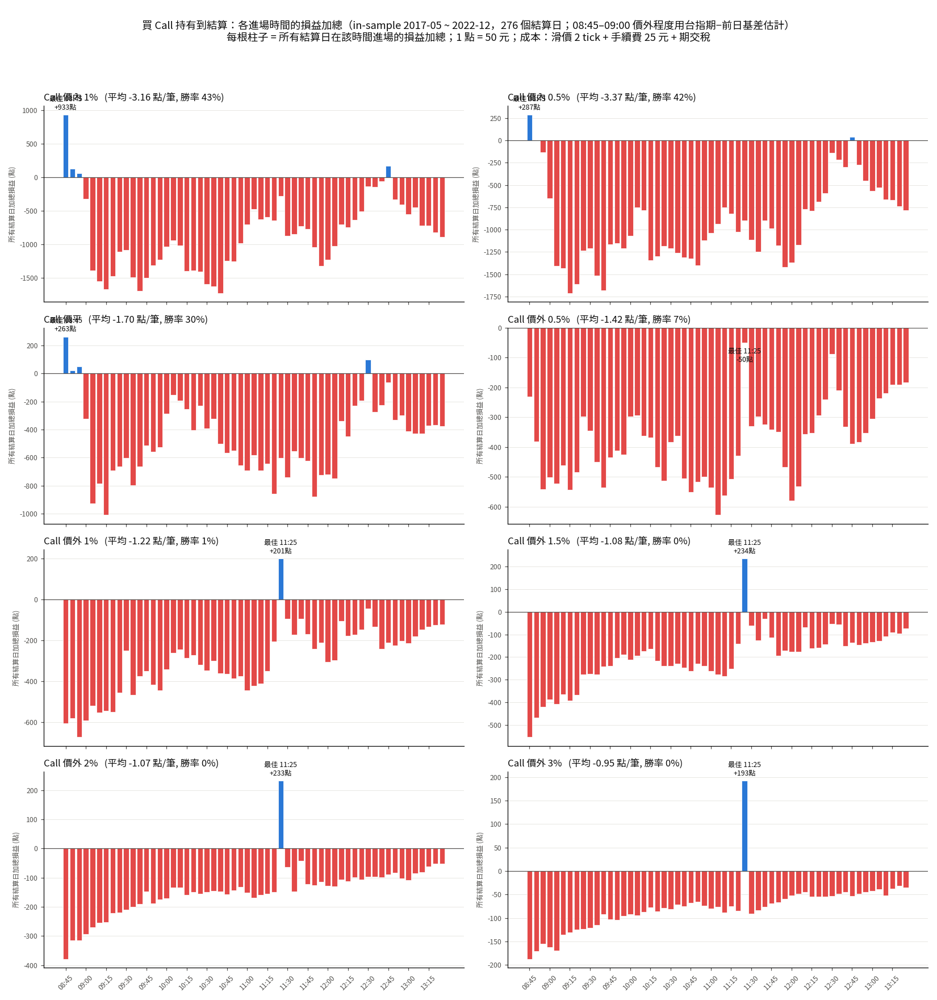
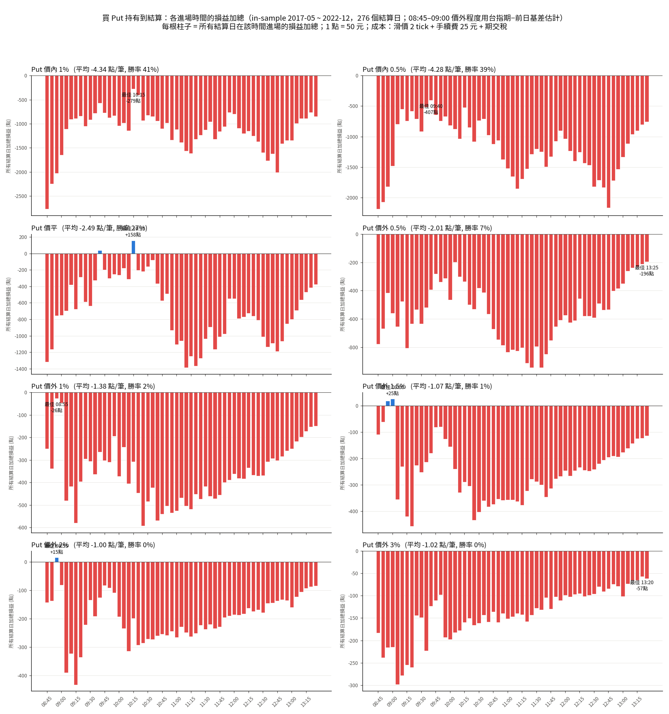
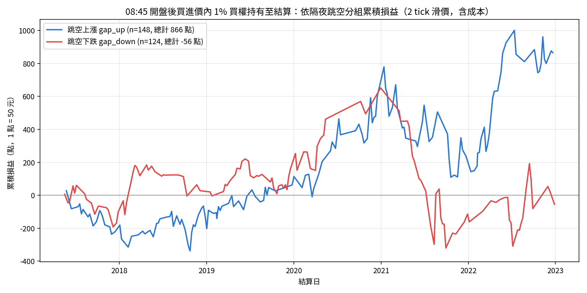
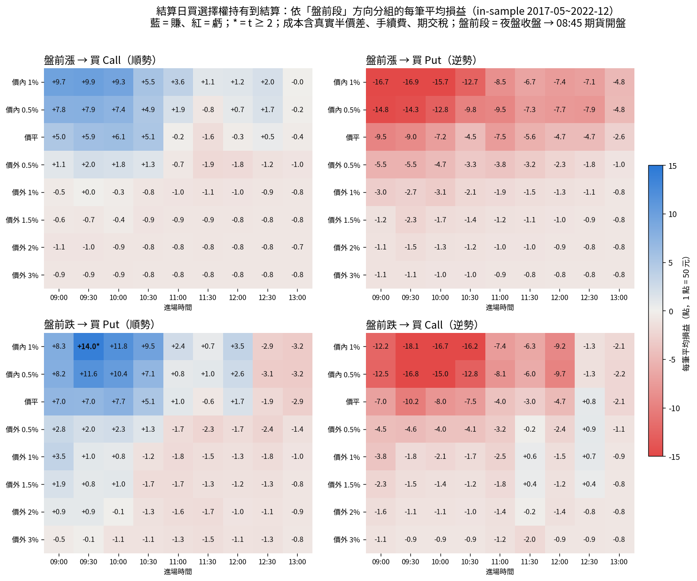
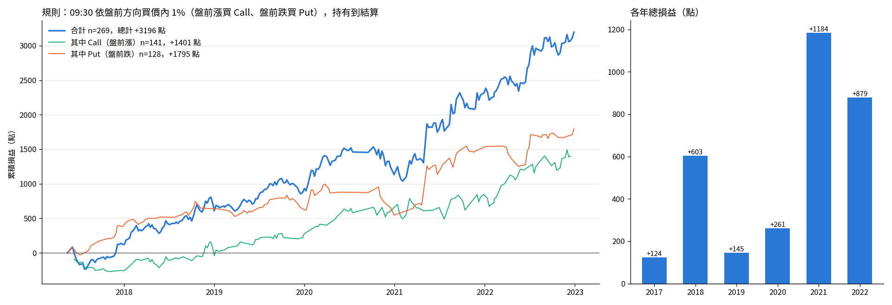
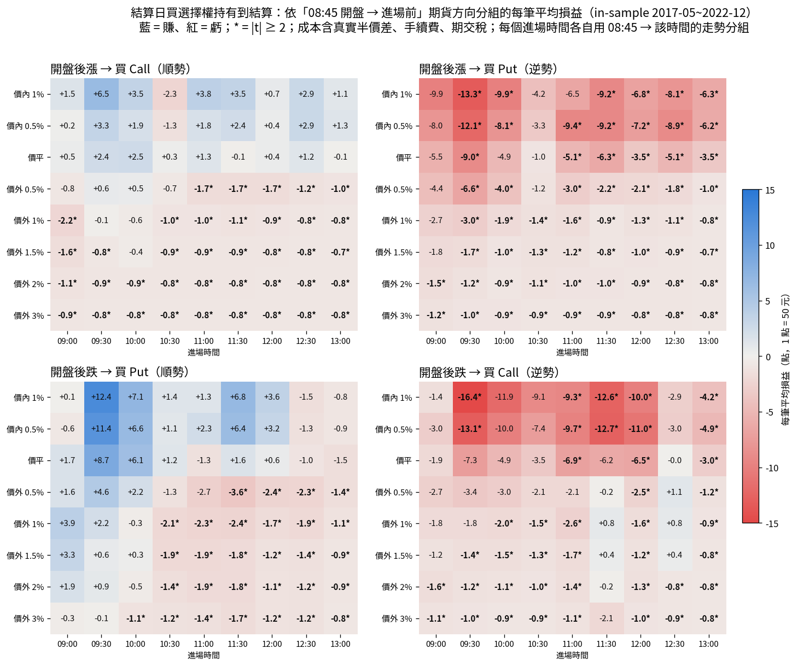
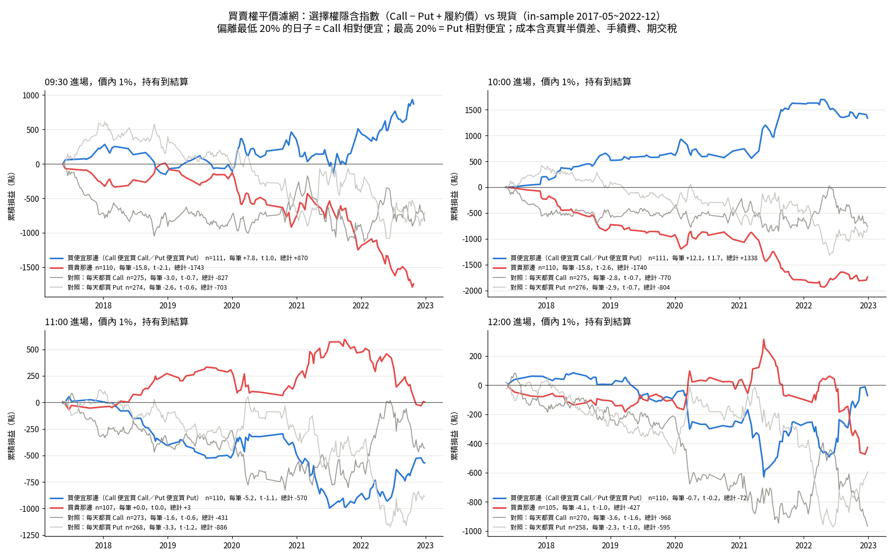
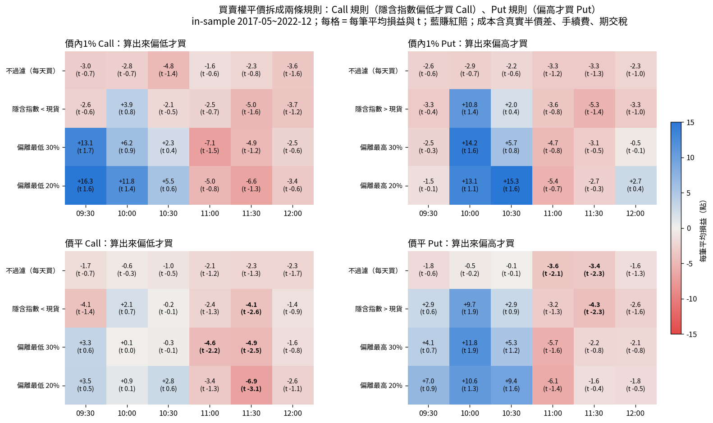

# 台指選擇權結算日 0DTE 買方研究

最後更新：2026-09-25（Step 2）

## 研究目標

找出結算日當天**幾點進場、買什麼**（Call 或 Put、價內／價外多少），能讓「只買、持有到結算」有正期望值。

## 策略限制

- 只做**結算日當天到期**的台指選擇權（週三週選、週五週選、月選），只做當日。
- **只做買方**。
- **不主動出場**，全部持有到結算。
- 以**期交所公布的最後結算價（SSP）**計算結算金額。

---

## 資料

| 資料 | 來源 | 期間 | 備註 |
|---|---|---|---|
| 結算日曆、最後結算價 | 期交所官網 | 2002-01 → 2026-09 | 907 個結算日 |
| 選擇權逐筆成交 | FinMind `TaiwanOptionTick` | 2017-05 → 2026-09 | 只有成交、沒有 bid/ask；成交量為買賣雙邊加總（÷2 才是口數） |
| 台指期逐筆成交 | FinMind `TaiwanFuturesTick` | 同上 | 排除價差單 |
| 加權指數 5 秒 | FinMind `TaiwanVariousIndicators5Seconds` | 同上 | |
| 選擇權逐筆含 bid/ask | 永豐 Shioaji | 2023-01 → 2026-09（拉取中） | bid/ask 自 2023-01-04 起才有值 |

資料品質：
- FinMind 選擇權日盤缺 15 天（2020-05 → 2021-05），in-sample 目前先排除。
- **09:00:00 那一筆加權指數是前一日收盤價**，不能當開盤價用。
- 開盤頭幾分鐘，很多成分股還沒成交，加權指數還沒反映跳空，09:00–09:05 的指數不可靠。

## 最後結算價（SSP）規則驗證

SSP = 最後結算日 **13:00（不含）至 13:25（含）** 的加權指數，加上**最後一筆收盤指數**，取簡單算術平均，四捨五入到整數。

用 5 秒指數重算 2017-05 → 2026-09 共 544 個結算日，**全部誤差 ≤ 0.5 點**，只是四捨五入造成的，確認這段期間規則沒有改變。

## 樣本切分

- **In-sample：2017-05-15 → 2022-12-31**。只有成交價，用成交價加上保守的成本。
- **Out-of-sample：2023-01 → 2026-09**。有真實 bid/ask，用賣價（ask）進場。**目前尚未查看損益。**

---

## 方法（Step 1：無條件報酬地圖）

每個結算日、每個進場時間、每個價外程度，Call 和 Put 分開，各買 1 口，持有到結算。

- **進場時間**：08:45 → 13:25，每 5 分鐘一個，共 57 個時間點。
- **價外程度**：進場當下，離「現在指數」的 %，價外為正。分成價內 1%、價內 0.5%、價平、價外 0.5%、1%、1.5%、2%、3%。每天在每個時間點挑**最接近目標 % 的那一檔**履約價。
  - Call 的目標履約價 = S × (1 + 價外%)；Put 的目標履約價 = S × (1 − 價外%)
- **「現在指數」S 怎麼定**
  - 08:45 → 09:00：用**近月台指期 − 前一日 13:30 的基差（期貨 − 現貨）**估計。現貨還沒開盤，或還沒反映跳空。
  - 09:05 以後：用加權指數。
  - 交叉驗證：08:45 用期貨估出的指數，跟用選擇權 Call − Put + K 反推的價平比較，中位數差 0.03%，90% 的日子在 ±0.29% 以內。
- **進場價**：進場時間後 **5 分鐘內的第一筆成交價 + 2 個跳動點（滑價）**。5 分鐘內沒有成交就當作買不到，跳過這一筆。
  - 跳動點：權利金 < 10 為 0.1；10–50 為 0.5；50–500 為 1；500–1000 為 5；≥ 1000 為 10。
  - 敏感度測試：另外用 1 個、4 個跳動點各算一次。

## 成本（保守估計）

| 項目 | 設定 |
|---|---|
| 進場手續費 | 0.5 點（25 元／口）。實際 28 折約 14 元，這裡往上抓 |
| 進場期交稅 | 權利金 × 0.1% |
| 結算手續費（只有價內） | 0.5 點（25 元） |
| 結算期交稅（只有價內） | SSP × 0.002% |
| 滑價 | 成交價 + 2 個跳動點 |

1 點 = 50 元。

## 損益公式

```
結算金額  Call = max(SSP − K, 0)
          Put  = max(K − SSP, 0)
進場價    = 5 分鐘內第一筆成交價 + 2 × 跳動點
損益（點）= 結算金額 − 進場價 − (0.5 + 0.001 × 進場價) − [價內時] (0.5 + 0.00002 × SSP)
```

驗證：隨機抽 30 筆，從原始資料逐筆手算，30 筆全部一致。

## 已知限制

- In-sample 沒有 bid/ask，「成交價 + 2 跳動點」可能低估實際成本，尤其是**開盤頭幾分鐘**和**價內合約**，這兩種情況的價差最寬。
- 只買 1 口，沒有考慮掛單量能不能吃得下。
- 08:45–09:00 的價外程度是估計值，誤差約 ±0.3%。

---

## 結果：Call



每根柱子 = in-sample 所有結算日（276 天）在該時間進場的損益加總（點）。

### 發現 1：無條件買 Call 沒有穩定的優勢

- Call 和 Put 合計 912 個格子（8 種價外程度 × 57 個時間點 × 2），拿掉 2021-05-12 之後，只有 10 個格子平均為正，最高 t 值 0.88，**沒有一個統計上顯著**。
- 價外越深，勝率越接近 0%；虧損主要是權利金加上固定的手續費和滑價。

### 發現 2：價外 Call 在 11:25 的大賺是單一事件

11:25 那根藍色柱子，幾乎全部來自 **2021-05-12**：盤中急殺約 8%，11:25 左右跌到最低點 15,165，之後反彈，結算在 15,901。

| 11:25 Call | 總筆數 | 賺錢筆數 | 加總損益 | 扣掉 2021-05-12 |
|---|---|---|---|---|
| 價外 0.5% | 273 | 12 | −50 點 | −547 點 |
| 價外 1% | 246 | 2 | +201 點 | −297 點 |
| 價外 1.5% | 176 | 1 | +234 點 | −176 點 |
| 價外 2% | 118 | 1 | +233 點 | −110 點 |
| 價外 3% | 62 | 1 | +193 點 | −55 點 |

**不是可以重複的訊號。**

### 發現 3（待驗證）：08:45 的價內 Call

價內、價平的 Call 在開盤頭幾分鐘表現最好，而且優勢隨時間快速消失：

| 價內 1% Call | 08:45 | 08:50 | 08:55 | 09:00 |
|---|---|---|---|---|
| 平均（點） | +3.42 | +0.47 | +0.20 | −1.18 |
| 中位數（點） | +6.63 | +6.19 | +4.19 | +2.66 |
| 勝率 | 55% | 53% | 52% | 51% |

- 08:45：273 筆，加總 +933 點，**中位數為正**，不是單一天撐起來的。
- 但扣掉最賺的 5 天變成 −215 點；t 值 0.72，**不顯著**。
- 分年不一致：2018、2019、2020、2022 年賺，2017、2021 年賠。
- 同一時間的價內 Put 虧最多（價內 1% 的 Put 平均 −10 點）。指數從 08:45 到結算平均只漲 0.017%，所以這不是漲勢造成的。

**兩種解釋，目前還分辨不出來：**
1. **開盤定價偏差**：開盤那一刻 Call 偏便宜、Put 偏貴，幾分鐘內就被修正。
2. **成交價不可信**：開盤價差最寬，第一筆成交可能落在便宜的一邊，實際用賣價買不到。

**驗證方式**：用 2023 年以後 Shioaji 的真實賣價（ask），確認 08:45 是否真的買得到這個價格。

## 結果：Put



和 Call 的圖一樣，每根柱子 = 276 個結算日在該時間進場的損益加總（點）；藍色是正、紅色是負。

### 發現 4：無條件買 Put 比買 Call 虧得更多，而且沒有任何正的格子

- 所有時間、所有價位加總：Put −258,092 點，Call −191,829 點，Put 虧得更多。
- 價內、價平虧最多：價內 1%、價內 0.5% 的 Put 平均每筆約 −4.3 點，價平 −2.5 點；越價外每筆虧得越少（約 −1.0～−1.4 點），但勝率只剩 0～2%。
- 圖上的藍色柱子只有幾根：價平 10:15（+158 點）、價平 09:40（+37 點）、價外 1.5%／2% 的 08:55～09:00（+15～25 點）。價平 10:15 最賺的一天就是 2021-05-12（+326 點），拿掉這天就變負。
- **拿掉 2021-05-12 之後，456 個 Put 格子沒有任何一格平均為正，最高 t 值 −0.27。** 發現 1 提到「只有 10 個格子平均為正」，那 10 個全部都是 Call。
- 開盤（08:45）的價內 Put 虧最多（價內 1% 加總約 −2,700 點），和發現 3「開盤 Call 偏便宜、Put 偏貴」的方向一致。

**結論**：無條件買 Put 沒有優勢，而且結構上比 Call 更貴。Put 只有在後面加上方向濾網（盤前、開盤後都跌）時才可能賺錢。

---

## Step 2：08:45 價內 1% Call，依開盤前資訊分組

策略固定為：**08:45 期貨開出第一筆後，買價內 1% 的 Call，持有到結算**。只改變分組條件，看哪些開盤前就知道的資訊可以區分好壞日子。樣本是 in-sample 2017-05 → 2022-12，成本同 Step 1（2 跳動點滑價 + 手續費 + 期交稅）。

### 定義（嚴格不偷看未來）

| 項目 | 定義 | 何時已知 |
|---|---|---|
| 前日收盤 | 近月台指期在前一交易日 13:45 以前的最後一筆 | 前一日 13:45 |
| 夜盤收盤 | 同一合約在前日 15:00 之後、當日 08:45 之前的最後一筆（通常是 04:59 左右） | 當日 05:00 |
| 開盤 | 同一合約當日 ≥ 08:45:00 的第一筆 | 08:45:00 |
| 跳空 | 開盤 ÷ 前日收盤 − 1 | 08:45:00 |
| 夜盤段 | 夜盤收盤 ÷ 前日收盤 − 1 | 05:00 |
| 盤前段 | 開盤 ÷ 夜盤收盤 − 1（05:00 → 08:45 之間的變化） | 08:45:00 |
| 履約價 K | round((開盤 − 前日基差) × 0.99 ÷ 50) × 50，**不參考當天後來有成交的履約價** | 08:45:00 |
| 進場 | K 的 Call 在**嚴格晚於期貨開盤那一筆**、且 08:50 前的第一筆成交 + 2 跳動點 | 08:45 之後 |

程式逐筆斷言：進場時間 > 期貨開盤時間（全部通過，中位數晚 7.5 秒）；前日收盤時間落在 13:44:58–13:45:00；夜盤收盤時間早於開盤。兩段報酬合成後與跳空的誤差 < 1e-13%。

### 結果 A：開高 vs 開低

| 組別 | 天數 | 平均 | 中位數 | 勝率 | 總計 | 扣掉最賺 5 天 | t 值 |
|---|---|---|---|---|---|---|---|
| 開高 | 148 | +5.85 | +11.2 | 58.8% | +866 | −80 | 0.89 |
| 開低 | 124 | −0.45 | −1.9 | 48.4% | −56 | −1,042 | −0.06 |



- Step 1 看到的 08:45 價內 Call 優勢，幾乎都來自開高的日子。
- 跳空幅度與損益的相關係數只有 0.009。
- 開低組有 4 天在 08:50 前沒有成交（2020-01-30、2022-01-19、2022-09-07、2022-10-12）。

### 結果 B：跳空拆成夜盤段、盤前段（各自單獨分組）

| 分組 | 筆數 | 平均 | 中位數 | 勝率 | t 值 | 總計 | 扣掉最賺 5 天 |
|---|---|---|---|---|---|---|---|
| **盤前漲** | 140 | **+12.0** | +14.5 | **61.4%** | **1.72** | +1,675 | **+564** |
| 盤前跌 | 126 | −7.8 | −5.0 | 45.2% | −1.18 | −988 | −1,799 |
| 夜盤漲 | 150 | −0.5 | +7.6 | 54.7% | −0.07 | −70 | −936 |
| 夜盤跌 | 121 | +7.3 | +2.6 | 53.7% | 1.08 | +883 | −184 |

與損益的相關係數（n = 271）：

| | Pearson | Spearman |
|---|---|---|
| 盤前段 | 0.110 | 0.145 |
| 夜盤段 | −0.075 | −0.022 |
| 整段跳空 | 0.008 | 0.052 |

- **有預測力的是盤前段**，夜盤段沒有，甚至略為反向。兩段加起來的整段跳空反而幾乎沒有相關，因為兩個方向互相抵消。
- **盤前漲**是目前第一個「扣掉最賺 5 天後仍為正」的條件。分年看，盤前漲的平均在 6 年中有 5 年高於盤前跌（2020 年例外）。
- 夜盤段和盤前段的相關係數是 −0.09，盤前有輕微「反向修正夜盤」的傾向。
- 交叉分組（夜盤 × 盤前）也一致：固定盤前方向時，夜盤漲跌只差約 5–8 點，而且不顯著；決定好壞的是盤前方向。
- 仍然**沒有任何一組 t 值超過 2**，目前屬於弱訊號。

資料備註：17 天的夜盤跨到假日，資料裡只有到 23:59（夜盤收盤取 23:59 那一筆）；2018-07-11 沒有夜盤資料，這一天排除。排除這 17 天後結論不變。

### 待確認的疑點

盤前段的終點就是 08:45 期貨開盤價，而我們在期貨開盤後幾秒內買 Call。若期貨開高、**選擇權第一筆成交還停在舊價位**，Call 會顯得便宜。這可能是真的機會，也可能只是開盤時報價落後、實際掛單買不到。這跟 Step 1「08:45 價內 Call」的疑點是同一件事，正在用 2025–2026 年的真實 bid/ask 驗證（只看報價，不看損益）。

---

## 成本修正：開盤的真實價差（2025–2026 Shioaji 報價）

用真實 bid/ask 檢查後發現，「第一筆成交 + 2 跳動點」**嚴重低估**開盤成本：

| 買賣價差中位數 | 第一筆成交時 | 08:45:30 | 09:00 |
|---|---|---|---|
| 價內 1% Call | 34 點 | 41 點 | 7 點 |
| 價平 Call | 30 點 | 10 點 | 2 點 |

→ Step 1、Step 2 裡 08:45 的正報酬，主要來自低估的成本，**不可信**。之後一律改用「真實價差模型」：依半小時時段 × 履約價位置 × Call/Put，取 2026 年報價的相對半價差中位數，至少 1 個跳動點，進場價 = 成交價 + 半價差。

## Step 3：集合競價（08:45 開盤撮合）進場

盤前漲時買價內 1% Call：每筆 +18.4 點，t = 2.5。但這個結果依賴「試撮價 ≈ 開盤價」的假設，而且集合競價量很小（中位數約 2–3 口），實際能成交的量有限。試撮歷史資料沒有免費來源，所以不再深入。

另外測了前一日三大法人的 8 個指標，各自分正負，共 16 組，**沒有一組顯著**（最大 t = 1.27）。

## Step 4：時間濾網（09:00 起，真實價差模型）

在 09:00–13:00 每半小時進場、持有到結算，分履約價（價內 1% ~ 價外 3%），Call 和 Put 都測。**無條件進場時，全部格子都在 0 附近或為負。**

## Step 4b：時間濾網 × 盤前方向

盤前段 = 前一日夜盤收盤 → 當日 08:45 期貨開盤價，只用進場前已知的資訊。



讀圖：每格是該時間進場、該履約價的**每筆平均損益（點）**，藍色賺、紅色賠，* 表示 t ≥ 2。

- **順勢買價內**（盤前漲買 Call、盤前跌買 Put）在 09:00–10:30 為正；**逆勢買**賠很多。
- 原因是盤中動能延續：從 09:30 到結算，大盤在盤前跌的日子平均 −0.186%（t −3.6），盤前漲的日子平均 +0.085%（t 1.8）。

### 合併規則：09:30 依盤前方向買價內 1%



| 指標 | 數值 |
|---|---|
| 交易筆數 | 269 |
| 每筆平均 | +11.9 點（t = 2.60） |
| 勝率 | 58% |
| 總損益 | +3,196 點（Call +1,401 / Put +1,795） |
| 扣掉最賺 5 天 | +1,662 點 |
| 排除 2021-05-12 | 每筆平均 +9.8 點 |
| 逐年 | 2017 +124、2018 +603、2019 +145、2020 +261、2021 +1,184、2022 +879（6/6 年為正） |

注意：這個規則是在 in-sample 裡從多個時間 × 履約價 × 方向中挑出來的，有多重檢定的風險，必須用 out-of-sample 確認。

## Step 4c：時間濾網 × 開盤後方向（不和盤前交叉）

開盤後段 = 台指期近月從 08:45 開盤價 → 進場時間前最後一筆成交。每個進場時間各自用自己的區間，例如 09:30 進場就看 08:45→09:30。只用進場前已知的價格。



- 方向和盤前相同：**順勢買價內賺、逆勢買賠**，例如開盤後跌、09:30 買價內 1% Call，每筆平均 −16.4 點。
- 但順勢這邊**沒有任何一格 t ≥ 2**（最大 1.62），而且多數靠少數幾天。例如開盤後跌、09:30 買價內 1% Put：每筆 +12.4 點，扣掉最賺 5 天後變成 −34。
- 和盤前規則比較（09:30、價內 1%、順勢，Call + Put 合計）：

| 濾網 | 筆數 | 每筆平均 | t | 扣掉最賺 5 天 | 正報酬年數 |
|---|---|---|---|---|---|
| 盤前方向 | 269 | +11.9 | 2.60 | +1,662 | 6/6 |
| 開盤後方向（08:45→09:30） | 273 | +8.9 | 1.93 | +905 | 4/6（2017、2018 為負） |

- 09:30 時，開盤後方向和盤前方向只有 **49% 相同**，兩者幾乎獨立。

## Step 5：買賣權平價（找錯誤定價）

### 定義

結算日選擇權只剩幾小時，同一履約價理論上 **Call − Put + 履約價 = 現貨**。

**為什麼成立**：同一個履約價 K，買 1 口 Call、賣 1 口 Put，到結算時：
- 結算價 > K：Call 賺「結算價 − K」，Put 不用賠 → 損益 = 結算價 − K
- 結算價 < K：Call 歸零，Put 要賠「K − 結算價」→ 損益 = 結算價 − K

不論漲跌，結果都是「結算價 − K」，跟直接持有大盤一樣。所以 Call − Put 應該等於「現貨 − K」，移項就是 Call − Put + K = 現貨（結算日幾乎沒有利息、股利的差別）。左邊這個數稱為「選擇權隱含的指數」。

**範例**（現貨 17,000，履約價 16,900）：
- Call 130、Put 25 → 130 − 25 + 16,900 = 17,005，和現貨差不多，正常。
- Call 110、Put 25 → 16,985，比現貨低 15 點 → Call 相對 Put 便宜（或 Put 相對 Call 貴）。
- Call 130、Put 10 → 17,020，比現貨高 20 點 → Put 相對 Call 便宜。

注意：「平價」是買賣權平價（put-call parity），和「價平」（履約價等於現價，ATM）是不同的東西。


- 用進場前 5 分鐘內、價平附近（±1.5%）同一履約價的 Call、Put 最後一筆成交（兩筆相隔 ≤ 60 秒），算出選擇權隱含的指數，再和當時現貨比較。
- 偏離 = 隱含指數 ÷ 現貨 − 1，取各履約價的中位數。
- **偏離 < 0 → Call 相對便宜（或 Put 相對貴）→ 買 Call；偏離 > 0 → Put 相對便宜 → 買 Put。**
- 只測 09:30～13:00：09:00 附近現貨指數仍是舊價格。
- 偏離很小：標準差 0.08%（約 10 點），大約一兩個買賣價差。

### 結果



- **偏離能預測大盤方向，但方向和「買便宜那邊」相反**：隱含指數低於現貨時，之後現貨會跌（最低 20%：平均 −0.079%，t −4.0）。意思是選擇權比現貨指數先反映方向，並不是定價錯誤。11:00 以後相關更強，但那主要是結算價平均區間已經開始，無法用來賺錢。
- 價內 1%，偏離最低 20% 買 Call、最高 20% 買 Put：

| 進場 | 買便宜那邊 | 買貴那邊 |
|---|---|---|
| 09:30 | n 111，每筆 +7.8，t 1.0 | 每筆 −15.8，t −2.1 |
| 10:00 | n 111，每筆 +12.1，t 1.7 | 每筆 −15.8，t −2.6 |
| 11:00 | 每筆 −5.2 | 每筆 0.0 |
| 12:00 | 每筆 −0.7 | 每筆 −4.1 |

  貴的那邊確實被高估，但便宜的那邊扣掉成本後賺不到顯著的錢。

### 拆成兩條規則：Call 偏低才買、Put 偏高才買

- **Call 規則**：隱含指數低於現貨（Call 相對便宜）才買 Call。
- **Put 規則**：隱含指數高於現貨（Put 相對便宜）才買 Put。
- 門檻三種：只看正負號；最極端 30%；最極端 20%。分位數依每個進場時間各自計算。價內 1% 與價平都測。



價內 1%，每筆平均損益（t）：

| 規則 | 門檻 | 09:30 | 10:00 | 10:30 | 11:00 以後 |
|---|---|---|---|---|---|
| Call | 不過濾 | −3.0 | −2.8 | −4.8 | 全負 |
| Call | 正負號 | −2.6 | +3.9 | −2.1 | 負 |
| Call | 最低 30% | +13.1 (1.66) | +6.2 | +2.3 | 負 |
| Call | 最低 20% | +16.3 (1.58) | +11.8 (1.38) | +5.5 | 負 |
| Put | 不過濾 | −2.6 | −2.9 | −2.2 | 全負 |
| Put | 正負號 | −3.3 | +10.8 (1.45) | +2.0 | 負 |
| Put | 最高 30% | −2.5 | +14.2 (1.63) | +5.7 | 負 |
| Put | 最高 20% | −1.5 | +13.1 (1.15) | +15.3 (1.65) | 大致負 |

- **方向對**：不過濾時全部為負，加濾網後 09:30～10:30 大多翻正，門檻越嚴每筆越多，代表便宜的那邊確實較便宜。
- **不顯著**：72 格中最大 t 只有 1.66（價內）／1.88（價平 Put 10:00），這個數量的格子光靠運氣就會出現幾格接近 2。
- **最佳時間不一致**：Call 在 09:30 最好，Put 在 10:00～10:30 最好。
- **11:00 以後失效**：結算價的方向已大致確定，便宜只是在反映方向。
- **結論**：錯誤定價存在，但幅度只有一兩個買賣價差，扣掉成本後賺不到可靠的錢；遠不如 09:30 依盤前方向的規則。不列入規則；out-of-sample 時可以順便觀察（不作為判斷依據）。

### 當成排除條件（要買的那邊太貴就不買）

「貴的程度」：買 Call 時用偏離值，買 Put 時用負的偏離值。

| 規則 | 不過濾 | 貴 > +0.02% 不買 |
|---|---|---|
| 09:30 只看盤前 | n 266，每筆 +11.8，t 2.56 | n 155，每筆 +11.7，t 2.19 |
| 10:00 只看盤前 | n 268，每筆 +10.5，t 2.52 | n 160，每筆 +18.3，t 3.25 |

- 09:30 無效，10:00 有效，兩個時間結論相反；每天都買再加排除條件，仍然是 0 或負。
- **結論：不加入規則。** 平價偏離能預測方向，但不能當成買方的錯誤定價，排除條件的效果也不穩定，而且會增加多重檢定的風險。

## Step 7：盤前 × 開盤後 × 平價（交叉）

### 條件

- **兩段同向**：盤前段（前一日夜盤收盤 → 08:45 期貨開盤）和開盤後段（08:45 期貨開盤 → 進場前最後一筆期貨成交）同方向。兩段都漲買 Call，兩段都跌買 Put，方向不一致不交易。從 09:30 到結算價，大盤在「兩段都漲」的日子平均 +0.123%（t 2.24），「兩段都跌」平均 −0.360%（t −3.28），方向不一致的日子接近隨機。
- **平價符合**（參數固定：滾動 50 個結算日、30%）：
  - Call：偏離 ≤ 過去 50 個結算日（同一進場時間）偏離的第 30 百分位 → Call 相對 Put 偏便宜。
  - Put：偏離 ≥ 過去 50 個結算日的第 70 百分位 → Put 相對 Call 偏便宜。
  - 門檻每天只用當天以前的資料重算，會隨波動調整，沒有偷看未來。前 50 個結算日當暖機，所以樣本從 2018-05 開始。
  - 為什麼不用固定數值門檻：偏離的波動在 2020 年後約變成兩倍（標準差 0.05～0.07% → 0.09～0.11%），固定門檻的意義會漂移。
  - 注意：30% 是看過全樣本結果（正負號／30%／20%）後選的，有參數挑選偏誤；已固定，不再調整。

### 結果（價內 1%，in-sample 2018-05～2022-12）


| 規則 | 進場 | 條件 | 筆數 | 每筆 | t | 總計 | 扣掉最賺 5 天 |
|---|---|---|---|---|---|---|---|
| Call | 09:30 | 兩段同向（全部） | 64 | +24.1 | 2.60 | +1,542 | +616 |
| Call | 09:30 | 平價符合 | 16 | +50.2 | 2.28 | +804 | +68 |
| Call | 09:30 | 平價不符合 | 48 | +15.4 | 1.57 | +738 | +96 |
| Call | 10:00 | 平價符合 | 19 | +17.2 | 0.84 | +328 | −269 |
| Put | 09:30 | 兩段同向（全部） | 39 | +38.9 | 2.02 | +1,515 | +149 |
| Put | 09:30 | 平價符合 | 17 | +32.1 | 1.50 | +546 | −101 |
| Put | 10:00 | 兩段同向（全部） | 39 | +31.8 | 2.02 | +1,242 | +99 |
| Put | 10:00 | 平價符合 | 17 | +61.0 | 2.23 | +1,037 | +111 |
| Put | 10:00 | 平價不符合 | 22 | +9.3 | 0.54 | +205 | −381 |

- 平價只在 Call 09:30、Put 10:00 明顯有用；其他時間 Call／Put 效果不一致（Put 11:00 以後平價符合反而賠錢）。
- 每組只有 15～20 筆，扣掉最賺 5 天多數接近 0，需要 out-of-sample 確認。

---

## Out-of-sample 規則（2026-09-26 鎖定，跑之前不再修改）

兩個方案一起驗證，都是價內 1%（最接近的履約價）、持有到結算、用期交所最後結算價計算，一天最多一筆。

**方案 A**：09:30 進場（取 09:30–09:35 第一筆可成交）
- 盤前漲、開盤後（08:45 → 09:30）也漲 → 買 Call
- 盤前跌、開盤後也跌 → 買 Put
- 方向不一致 → 不交易

**方案 B**
- 09:30：盤前漲、開盤後漲，且平價符合（偏離 ≤ 過去 50 個結算日 09:30 偏離的第 30 百分位）→ 買 Call。平價符合 = Call 相對 Put 便宜，便宜程度在最近 50 個結算日中排前 30%
- 10:00：盤前跌、開盤後（08:45 → 10:00）也跌，且平價符合（偏離 ≥ 過去 50 個結算日 10:00 偏離的第 70 百分位）→ 買 Put。平價符合 = Put 相對 Call 便宜，便宜程度在最近 50 個結算日中排前 30%
- 其他情況不交易

In-sample 對照（2018-05～2022-12，同一段期間）：

| | 方案 A | 方案 B |
|---|---|---|
| 筆數 | 103 | 33 |
| 每筆 | +29.7 | +55.8 |
| t | 3.21 | 3.20 |
| 勝率 | 63% | 73% |
| 總計 | +3,058 | +1,841 |
| 扣掉最賺 5 天 | +1,561 | +543 |
| 最大回檔 | 211 點 | 60 點 |
| 排除 2021-05-12 的每筆 | +24.4 | +44.2 |
| 逐年 | 2018 −48、2019 +356、2020 +533、2021 +1,298、2022 +918 | 2018 +47、2019 +207、2020 +354、2021 +963、2022 +269 |

- **期間**：2023-01 → 2026-09
- **成本**：有 Shioaji 報價的日子用真實賣價（ask）；沒有的日子用 FinMind 成交價 + 真實價差模型；另計手續費與交易稅
- **平價計算**：同 Step 5（進場前 5 分鐘內、價平附近 ±1.5% 同一履約價 Call／Put 最後成交，相隔 ≤ 60 秒）；滾動窗口延續 in-sample 最後 50 個結算日
- **判斷標準**：每筆平均 > 0，並且扣掉最賺 5 天後仍 > 0，才算通過

## Step 8：Out-of-sample 結果（2023-01 ～ 2026-09-18）

規則照上面鎖定的版本，完全沒有修改。2026-09-23 尚未納入（FinMind、Shioaji 都還沒抓）。

### 資料與檢查

- 253 個結算日。成本：Shioaji 真實賣價（進場時間後 5 分鐘內第一筆 tick 的 ask）；ask 為 0 時用該 tick 成交價＋價差模型；Shioaji 缺 2023-07-05（日盤成交量為 0），改用 FinMind 成交價＋價差模型；5 分鐘內沒有任何成交就不交易。
- 同一套程式重算 in-sample，盤前方向、開盤後方向、平價偏離、履約價、損益和原本完全一致（差距 0）。
- 平價門檻：用 in-sample 最後 50 個結算日接續滾動計算，每天只用當天以前的資料。

### 績效


| | 方案 A | 方案 B |
|---|---|---|
| 筆數 | 123 | 50 |
| 每筆 | +36.1 | +91.3 |
| t | 1.85 | 2.83 |
| 勝率 | 57% | 68% |
| 總計 | +4,444 | +4,564 |
| 扣掉最賺 5 天 | +878 | +1,484 |
| 最大回檔 | 1,439 點 | 608 點 |
| Call | n 70，每筆 +51.1，t 2.34，總計 +3,579 | n 31，每筆 +76.5，t 2.05，總計 +2,371 |
| Put | n 53，每筆 +16.3，t 0.47，總計 +865（扣最賺 5 天 −1,843） | n 19，每筆 +115.4，t 1.92，總計 +2,193 |
| 逐年（點） | 2023 +122、2024 +1,205、2025 +743、2026 +2,374 | 2023 +474、2024 +320、2025 +206、2026 +3,565 |
| 每筆（損益 ÷ 指數） | 12.9 bp（t 2.26），四年皆正 | 28.0 bp（t 3.0），四年皆正 |
| 全部改用 FinMind＋價差模型 | +4,536 | +4,613 |

- **兩個方案都通過預設標準**（每筆 > 0，扣掉最賺 5 天後仍 > 0）。
- 真實賣價和價差模型的結果幾乎一樣，in-sample 用的成本假設可靠。
- 指數從 2023 年約 15,000 點漲到 2026 年 4 萬多點，權利金跟著變大，所以 2026 年的點數損益最大；改用 bp 衡量後，兩個方案每一年仍都是正的。
- **方案 A**：主要靠 Call；Put 扣掉最賺 5 天後是負的，等於沒有通過驗證。
- **方案 B**：Call、Put 都有正貢獻（t 約 2），回檔小，每筆約是 A 的 2.5 倍，平價濾網在 out-of-sample 有幫助。但 Call 在 2026 年以前大致持平，扣掉最賺 5 天後 Call、Put 各只剩 +162、+58，仍有依賴少數大賺日子的風險。
- 最賺的幾筆多在 2026 年（例如 2026-07-17 買 Put 約 +990～1,100 點）。

### 待處理

- 實際交易：價內 1% 的成交量與可下口數、滑價。
- 2026-09-23 之後的資料持續累積，當作額外的 out-of-sample。

---

## 檔案

- `scripts/step1_map.py`：逐日計算每筆交易
- `scripts/step1_plot.py`：加總與畫圖
- `scripts/build_basis.py`、`scripts/check_basis.py`：前日基差與驗證
- `results/step1/step1_trades_IS.parquet`：每一筆交易的明細
- `results/step1/step1_summary_IS.csv`：每個格子的統計
- `scripts/step2_gap.py` → `results/step2_gap/`：開高／開低分組（trades.csv 為每日明細）
- `scripts/step2_night.py` → `results/step2_night/`：夜盤段／盤前段分組與交叉（trades_night.csv、summary_*.csv）
- `scripts/step3_auction.py` → `results/step3_auction/`：集合競價進場
- `scripts/spread_model_v2.py`：真實價差模型
- `scripts/step4_timefilter.py` → `results/step4_timefilter/`：時間濾網
- `scripts/step4b_premkt_time.py`、`scripts/step4b_heatmap.py` → `results/step4b_premkt_time/`：時間 × 盤前方向
- `scripts/step4c_open_to_entry.py` → `results/step4c_open_to_entry/`：時間 × 開盤後方向
- `scripts/step5_parity.py`、`step5_analyze.py`、`step5_plot.py`、`step5b_exclude.py`、`step5c_split.py`、`step5c_plot.py` → `results/step5_parity/`：買賣權平價
- `scripts/step4d_cross.py` → `results/step4d_cross/`：盤前 × 開盤後交叉（Step 7 的基礎資料）
- `scripts/step7_cross3.py`、`step7b_rolling.py`、`step7c_fixed.py` → `results/step7_cross3/`：盤前 × 開盤後 × 平價
- `scripts/step8_oos.py`、`step8_eval.py`、`step8_plot.py` → `results/oos/`：out-of-sample 驗證（VM 端用 `scripts/oos_sj_extract.py` 從 Shioaji 抽出進場報價）
